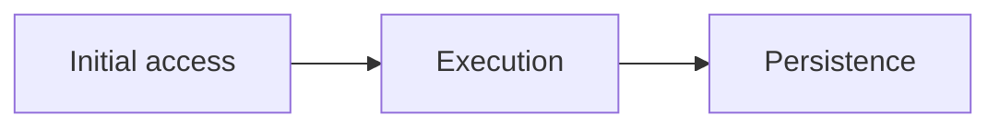

<!--
SCREENSHOT CHECKLIST (these comments never show on the page)
- Save screenshots next to this file, named NN-what-it-shows.png
- Crop to the evidence. Box the one field that matters (macOS Preview > Markup)
- Redact anything real: public IPs, usernames, hostnames, tenant IDs, tokens
- Every figure gets alt text (what it shows) and a caption (why it matters)
- Delete any slot you don't use, including its comment
-->

## TL;DR

Three sentences max. What happened, how it was detected, what fixes it.

## Scenario and scope

- **Environment:**
- **Data available:**
- **Out of scope:**
- **Sanitization:** All IOCs defanged. No real client data.

<!-- SCREENSHOT (optional): data source healthy or lab topology. -->
{{ "{{<" }} figure src="01-environment.png" alt="" caption="" {{ ">}}" }}

## Timeline

| Time (UTC) | Host | Event | Evidence |
|---|---|---|---|
|  |  |  |  |

<!-- SCREENSHOT (optional): SIEM timeline view. -->
{{ "{{<" }} figure src="02-timeline.png" alt="" caption="" {{ ">}}" }}

## Analysis

### Step 1: <what you looked at first and why>

```text
query or command here
```

<!-- SCREENSHOT (required): the query and its results together. Box the hit. -->
{{ "{{<" }} figure src="03-step1-query-results.png" alt="" caption="" {{ ">}}" }}

What it showed:

<!-- SCREENSHOT (recommended): the raw event expanded, key field boxed. -->
{{ "{{<" }} figure src="04-step1-event-detail.png" alt="" caption="" {{ ">}}" }}

### Step 2: <next pivot>

<!-- SCREENSHOT (optional): decoded payload or tool output. Defang URLs first. -->
{{ "{{<" }} figure src="05-step2-decode.png" alt="" caption="" {{ ">}}" }}

## Attack flow



## Detection

**KQL** (Sentinel analytics rule or Defender custom detection)

```kql

```

**Sigma source** (optional, when the rule was converted from one)

```yaml
title:
logsource:
detection:
```

<!-- SCREENSHOT (required): the rule firing or a passing rule test. -->
{{ "{{<" }} figure src="06-detection-firing.png" alt="" caption="" {{ ">}}" }}

False-positive notes:

## IOCs

| Type | Value (defanged) | Context |
|---|---|---|
|  |  |  |

## MITRE ATT&CK mapping

| Tactic | Technique | Evidence |
|---|---|---|
|  |  |  |

## Recommendations

**Contain (now):**

**Prevent (next 30 days):**

<!-- SCREENSHOT (optional): before and after. -->
{{ "{{<" }} figure src="07-remediation-verified.png" alt="" caption="" {{ ">}}" }}

## Lessons learned

What slowed me down, and what I'd do differently next time.
